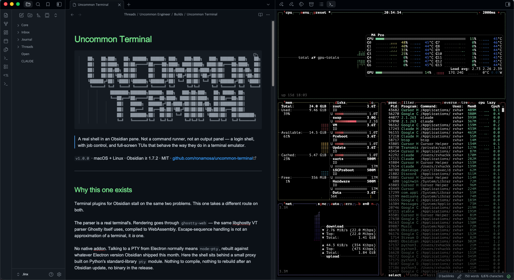

# Uncommon Terminal

A real shell in an Obsidian pane. Not a command runner, not an output panel — a
terminal, with a login shell, job control, and full-screen TUIs that behave the
way they do in a terminal emulator.



## Why this one

Terminal plugins for Obsidian usually stall on the same two problems, and this
one takes a different route on both.

**The parser.** Rendering is handled by [`ghostty-web`][ghostty-web], which
compiles the same libghostty VT parser that the Ghostty terminal uses to
WebAssembly. So the escape-sequence handling is a real terminal's, not an
approximation of one.

**The shell process.** Talking to a PTY from Electron normally means
`node-pty`, a native addon that has to be rebuilt against whichever Electron
version Obsidian shipped this month. Instead, the shell runs behind a small
proxy built on Python's standard-library `pty` module. There is nothing to
compile, nothing to rebuild after an Obsidian update, and no binary in the
release. Python 3 is already on every macOS install and effectively every
Linux one.

### Mouse-aware TUIs scroll properly

This is the reason the plugin exists.

Web terminals typically handle the scroll wheel in two branches: on the normal
screen they scroll their own scrollback, and on the alternate screen they
translate the wheel into Up and Down arrow keys. The arrow fallback is right
for pagers like `less` and `man`. It is wrong for any TUI that enables mouse
reporting and scrolls its own viewport — those apps never see the wheel events
they are waiting for, and they read the arrow keys they get instead as
navigation. Scrolling appears to do nothing, or does something surprising.

Uncommon Terminal checks whether the running app is on the alternate screen
*and* has asked for mouse tracking. When both hold, it encodes the wheel as a
genuine mouse-button report — SGR when the app has negotiated DEC mode 1006,
legacy X10 otherwise — and writes it to the PTY. Everything else falls through
unchanged, so pagers keep their arrow keys.

## Requirements

- macOS or Linux. Windows is not supported.
- Python 3, with the standard library intact. Almost certainly already present;
  the plugin detects it and tells you plainly if it is missing.
- Obsidian 1.7.2 or later, desktop only.

## Usage

Open a terminal from the ribbon icon, or from the command palette:

| Command | What it does |
| --- | --- |
| **Open terminal** | Opens one, or focuses the terminal already open |
| **Open terminal in a new split** | Always opens another, independent terminal |
| **Restart the shell in this terminal** | Restarts the shell, keeping the scrollback |

Right-clicking a file or folder in the explorer offers **Open terminal here**,
which starts a shell in that directory.

Every terminal is fully independent — its own shell, its own scrollback, its
own working directory. Open as many as you like, in tabs, splits, sidebars, or
a pop-out window.

## Configuration

If you use [Ghostty][ghostty], the plugin reads your existing config from
`~/.config/ghostty/config` (or the macOS Application Support location) and
follows it for font, colors, cursor, scrollback, shell, and keybinds. Nothing
to set up twice.

Settings in Obsidian override that config where you set them, and the built-in
palette is used only when neither has an opinion. So the resolution order is:

```
Obsidian settings  →  ~/.config/ghostty/config  →  built-in defaults
```

Font, color, and scrollback changes apply to terminals that are already open.

### Keybinds

Keybinds from your Ghostty config are merged with a small built-in set and
intercepted in the capture phase, so a key meant for the shell never reaches
Obsidian's global hotkeys. The built-ins are copy, paste, and the
kitty-protocol newlines for `shift+enter` and `cmd+enter` that TUIs use for a
soft line break.

## Installing

From **Settings → Community plugins → Browse**, search for *Uncommon Terminal*.

To build it yourself:

```bash
npm install
npm run check                  # lint, tests, and a production build
./deploy.sh /path/to/vault     # install into a vault
```

`npm run dev` watches and rebuilds. There is no `main.js` in the repo — it is
a build artifact, published as a release asset.

## How it fits together

Three layers and one process boundary:

| Layer | What it is |
| --- | --- |
| `src/main.ts`, `src/view.ts` | The plugin and its view. One terminal per leaf, independent of the others. |
| `ghostty-web` | libghostty's VT parser as WebAssembly, plus a canvas renderer. Booted once. |
| `pty_helper.py` | A stdlib `pty` proxy, one process per terminal. |

The helper's protocol is small and worth knowing if you touch either side:
`argv[1]` is the shell, stdin and stdout carry raw bytes, and **fd 3 is a
resize control pipe** taking 4-byte big-endian frames (rows `uint16`, cols
`uint16`). The Python source is bundled into `main.js` as text and written next
to the plugin whenever the copy on disk differs — so editing `pty_helper.py`
does nothing until you rebuild.

The pure logic — config parsing, keybind matching, wheel encoding — lives in
modules with no DOM dependency and is covered by tests: `npm test`.

## Credits

This plugin began as a fork of
[**obsidian-ghostty-terminal**][upstream] by **Mayank Lavania**, which is where
the Python-PTY approach and the initial Obsidian integration come from. That
work is MIT licensed, and this one keeps its copyright alongside its own. Thank
you.

It has since been restructured, and the wheel handling, settings, process
lifecycle, and test suite are new here.

- [`ghostty-web`][ghostty-web] by Coder — MIT
- [Ghostty][ghostty] by Mitchell Hashimoto, whose VT parser and config format
  this builds on. This plugin is not affiliated with the Ghostty project.

## License

MIT. See [LICENSE](LICENSE).

[upstream]: https://github.com/lavs9/obsidian-ghostty-terminal
[ghostty-web]: https://github.com/coder/ghostty-web
[ghostty]: https://ghostty.org
